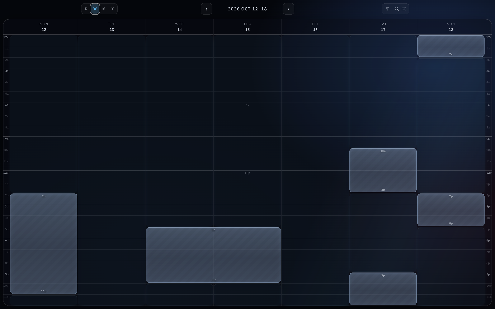
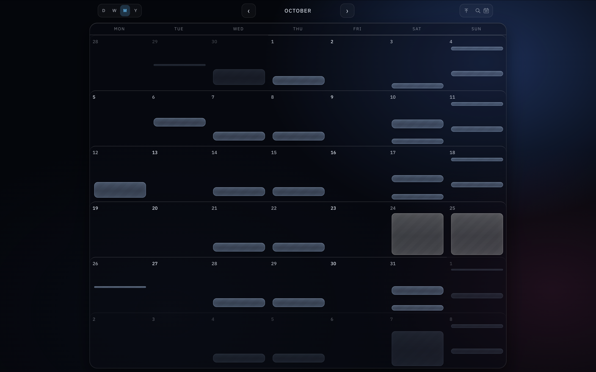
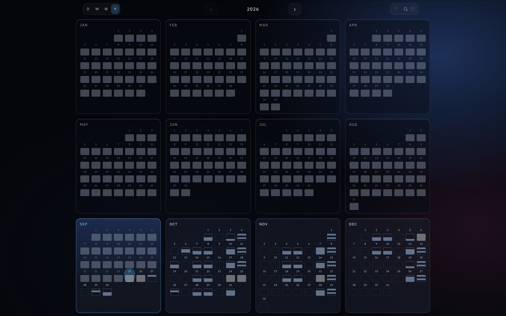

  
  
  

**Live:** https://rdfwcal.netlify.app

No other calendar app i found solved this particular problem, so i made one.

### Details

Calendar keeps each view inside the viewport so a single screenshot can communicate all relevant availability.

There are three main views:

- **Week** - hour-level availability across seven days.

- **Month** - shows the shape of free and busy time across several weeks.

- **Year** - shows broader availability patterns across months.

There's also a day view because making a calendar app without one would feel wrong.

Note that the current week view is the site's default presentation.
Navigating to another or seeking future dates encodes those params in a simple query string, making any view as sharable by link as by screenshot.

eg, `/?m&2610` takes us to a month view of October 2026, `/?270104` to the week containing 2027's January 4th (as week view is the default), and `/?y&29` to the full year of 2029.

All data in this case comes from my google calendar, exposing free/busy status, and none else, over API.

This was a short project to fix a problem in my life, not intended as distributable software. If anyone likes the idea, a short refactor could add a settings page + firebase realtime db, creating a simple reusable template.

#### TypeScript · React · Vite · Google Calendar API · Netlify
